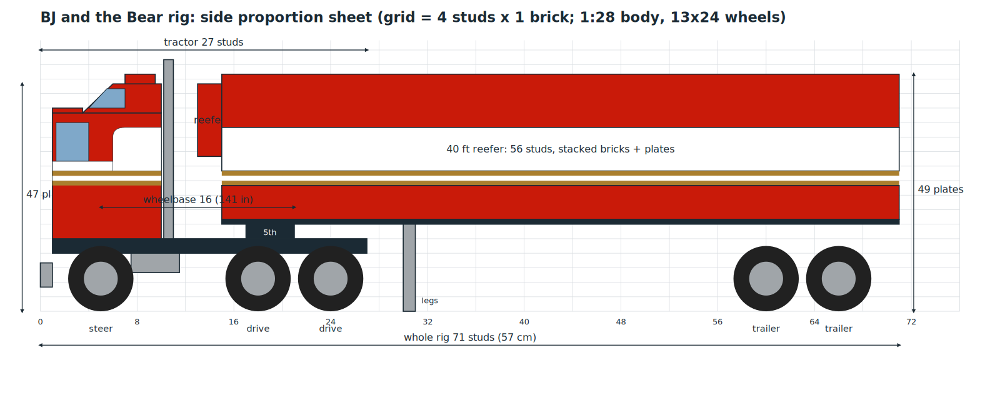
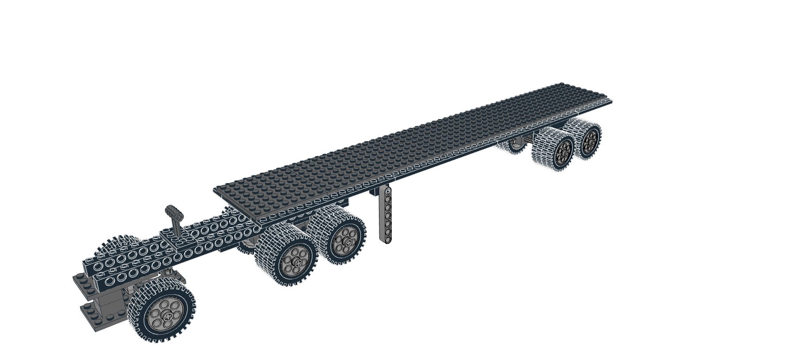
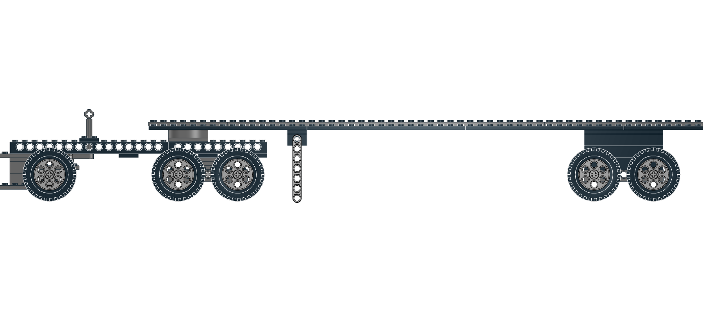
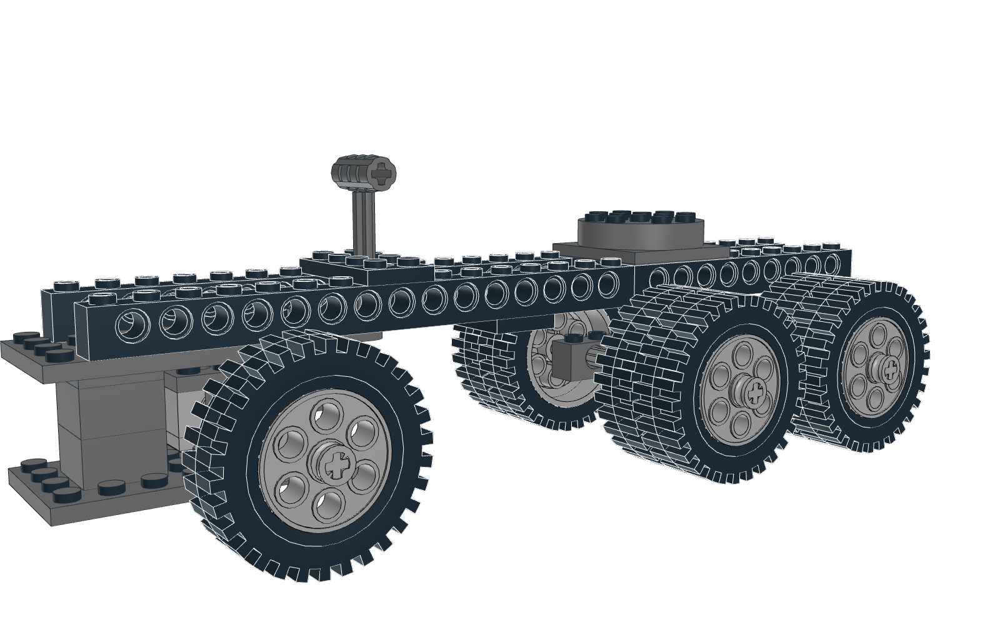
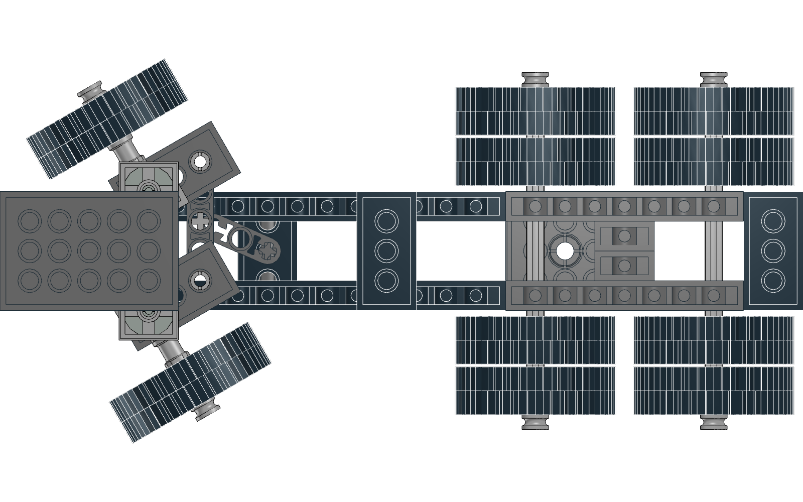

# BJ and the Bear: Design Sheet (Phase 1)

**Status: Phase 1 is agreed. The Phase 2 rolling chassis is built and waiting
for review (section 8). Heights below include the one-plate frame raise from
Phase 2.** The settings:
- **1:28** body on the 13x24 wheels
- **40 ft** refrigerated trailer
- **16-stud** wheelbase
- **stacked-brick** trailer walls
- **gold, white, gold** pinstripes

The sheet is generated by `tools/proportion_sheet.py`. The grid is 4 studs by
1 brick. `renders/scale-compare.png` shows how 1:28 was chosen.

**References:** three diecast replica product photos, shared in the design
chat and not stored in the repo:
1. a straight side view of the full rig
2. a front 3/4 view of the full rig
3. a rear 3/4 view of the trailer alone

## 1. Units and scale

| Unit | Model | Real at 1:28 |
|---|---|---|
| 1 stud | 8 mm | 22.4 cm |
| 1 plate | 3.2 mm | 9.0 cm |
| 1 brick (3 plates) | 9.6 mm | 26.9 cm |
| Tire 2696, Ø 43.2 mm | Ø 5.4 studs (6.75 plates radius) | Stands for a 1.21 m tire, **about 17% oversize** |

The wheels are 2695 (Light Bluish Gray rim) with 2696 (tire). We use all
**18**.

- **Tire width:** 12.8 mm, about 1.6 studs. A **dual pair** takes about 3.4
  studs.
- **Rim hub:** a round center hole. Wheels spin freely on a Technic axle or pin.
- **Axle height:** the axle centers sit 6.75 plates off the ground.
- **What the wheels fix:** the wheel size sets three things whatever the scale:
  - the frame height (top at 14 plates)
  - the trailer floor height
  - the minimum tandem spacing of 6 studs

  The body above the frame follows 1:28.

## 2. Width

| Item | Studs |
|---|---|
| Cab and trailer body | **10** |
| Over the dual tires | about 11. The duals sit about ½ stud proud of the body on each side. That's normal for the oversize wheels and keeps room for the mechanisms |
| Between the inner duals | about 4.2 |
| Frame | 3–4 wide. Phase 2 settles this around the steering and walking beam |

## 3. Coordinate reference

All positions are in **studs measured back from the front bumper face**, and
in **plates up from the ground**.

### Tractor: 1978/79 Kenworth K100 Aerodyne, tandem-drive axles

| Feature | Position / size | Notes |
|---|---|---|
| Bumper | x 0–1, 5–10 plates | Chrome |
| Cab + sleeper | x 1–10 (9 studs) | Bumper to back of cab is 10 studs, about 2.2 m (86" BBC) |
| Cab bottom edge | 15 plates | Sits above the steer tire. The steps and the wheel housing hang below it |
| Front roof / visor | x 1–3.5, 41–42 plates | Red sun visor |
| Aerodyne roof | slopes up from x 3.5 to x 6, flat at 47 plates to x 10 | Forward-facing upper sleeper window in the slope |
| Roof pod | x 7–9.5, 47–49 plates | Red. Its top lines up with the trailer roof. It also houses the steering knob |
| Steer axle | x 5 | |
| Drive axles | x 18 / x 24 | Duals, 6 studs apart (the minimum with these tires). Walking-beam pivot at x 21 |
| **Wheelbase** | **16 studs** | About 141 in at 1:28 |
| Frame rails | x 1–27, 12–15 plates | Raised one plate in Phase 2 so the tie rod fits underneath. Frame top = cab floor |
| Fifth wheel | centre x 19, 15–18 plates | A 4 × 4 turntable, 2 studs ahead of the tandem centre |
| Fuel tank + steps | x 7.5–11.5, 8–12 plates | Chrome |
| Exhaust stacks | x 10.2–11, up to 52 plates | Twin chrome stacks in the gap behind the cab |
| Quarter fenders | over the drive axles | Chrome |
| **Tractor length** | **27 studs** (21.6 cm) | |

### Trailer: 40 ft refrigerated trailer

| Feature | Position / size | Notes |
|---|---|---|
| Box | rig-x 15–71 (**56 studs**) | About 41 ft at 1:28. 56 is 7 × 8, so it's all 1 × 8 bricks and plates |
| Bottom rail | 18–19 plates | Black floor plates. The underside sits on the fifth wheel |
| Walls | 19–49 plates (**30 plates**) | Stacked bricks and plates. See section 4 |
| Kingpin | trailer-x 4 (rig-x 19) | |
| Refrigeration unit | 2 studs ahead of the front wall, 32–47 plates, about 7 wide | Red, with a gray grille |
| Landing gear | trailer-x 15 (rig-x 30) | 3 studs clear of the tractor frame end |
| Trailer axles | trailer-x 45 / 51 | Duals, 6 studs apart |
| Rear | trailer-x 56 | Opening barn doors, lights, underride bar |

**Whole rig: 71 studs, about 57 cm long and 16 cm tall.**

### Clearances checked on paper

- **Cab back to reefer unit:** 3 studs. The stacks take 1 stud and 2 studs
  are clear.
- **Trailer swing around the kingpin:**
  - The reefer unit's corner swings on 6.9 studs.
  - The nearest point of the stacks is 9.5 studs from the kingpin, and the cab
    back corner is 10.3 studs away. Both clear.
- **Landing gear vs. the tractor when turning:**
  - The landing gear swings at 11.9 studs from the kingpin.
  - The tractor's outer rear tire corner is at 9.1 studs. It clears.
- **Trailer underside vs. the drive tires:** the drive tires' tops are at 13.5
  plates and the trailer underside is at 16, so there are 2.5 plates of room for
  the fenders and articulation.

## 4. Livery and wall layup

The same stripe stack runs along the cab and the trailer **at the same height**.
Heights are in plates above the ground.

| Plates | Cab side | Trailer wall (built as) |
|---|---|---|
| 38–49 | Windows (31–39) and roof: **red** | **Red**, 11 plates = 3 bricks + 2 plates |
| 29–38 | White band under the windows (29–31). **White panel on the rear of the sleeper** (x 6–10, up to 38) with a rounded front-top corner | **White**, 9 plates = 3 bricks |
| 28 | **Gold** pinstripe | Gold 1 × 8 plates |
| 27 | **White** pinstripe | White 1 × 8 plates |
| 26 | **Gold** pinstripe | Gold 1 × 8 plates |
| 15–26 (cab), 19–26 (trailer) | **Red** | **Red**, 7 plates = 2 bricks + 1 plate |

- **Cab front:** red above the stripe line. Below it, the front is white around a
  chrome grille, with rectangular headlights. The pinstripes wrap around the
  front corners.
- **Chrome parts:** bumper, grille, fuel tank, stacks, quarter fenders, mirror
  arms and air horns.
- **Door lettering:** skipped.
- **Trailer wall parts, first estimate per side:**
  - 8 brick courses × 7 = **56 1 × 8 bricks** (40 red, 16 white)
  - 6 plate layers × 7 = **42 1 × 8 plates** (21 red, 14 gold, 7 white)

  Double that for both sides. The front wall, the roof tiles and the bracing
  come on top. **Gold 1 × 8 plates (28 in all) are the part most likely to be
  scarce.** Pearl Gold 1 × 8 plates are rare. Mixing in 1 × 4 or 1 × 6 plates,
  or using Tan or Yellow, are the fallbacks.

## 5. Color palette (LDraw codes)

| Use | Color | LDraw code | Alternatives |
|---|---|---|---|
| Main body (cab and trailer) | Red | 4 | |
| Stripe band, centre pinstripe, cab rear panel, cab front | White | 15 | |
| Outer pinstripes | Pearl Gold | 297 | Tan 19 or Yellow 14 |
| Frame, trailer rail | Black | 0 | |
| Chrome | Flat Silver | 179 | Light Bluish Gray 71 |
| Glass | Trans-Clear or Trans-Black | 47 / 40 | |
| Tires / rims | Black / Light Bluish Gray | 0 / 71 | |

## 6. Mechanisms (as built in Phase 2)

See section 8 for the renders. The model is in `model/chassis.mpd`, generated by
`tools/build_chassis.py`.

- **Steering** (tested up to 30° in the model; about 35° before a tire touches
  the frame):
  - Each front wheel is a **knuckle**: a 1 × 2 Technic brick holding a 5-long
    stub axle, with a 2 × 4 Technic plate on top as the steering arm.
  - Each knuckle turns on a **2 × 2 turntable** below it. The turntables sit on
    a low 4 × 6 axle beam, and a post in front of the wheels ties the beam to
    the frame.
  - A **thin 5-long beam** is the tie rod. It rests on the steering-arm studs
    and is pinned to both arms.
  - A **3-long thin lever** on the vertical steering column pushes the tie rod.
  - The column rises through a bearing plate on the rails and ends in an
    **axle joiner**. When the cab is lowered, its roof-knob shaft drops into
    the joiner. It lifts out when the cab tilts.
- **Walking-beam tandem:** each side has a 1 × 8 Technic brick carrying both
  drive axles. The beams pivot on one cross axle through two hangers under the
  frame. That gives about 15° of rock, so all eight drive tires stay on the
  ground.
- **Fifth wheel:** a 4 × 4 turntable on the rails at x 19. The trailer's
  underside sits on its studs, so the trailer turns on the turntable and lifts
  straight off.
- **Landing gear:** two 7-long Technic beams swing down on friction pins
  under the trailer, at trailer-x 15. They're a hair longer than the ride
  height, so a parked trailer sits a little high and the tractor can back
  under it. Swing them up and back to stow.
- **Trailer axles:** a fixed sub-frame (1 × 8 bricks on 1 × 8 Technic bricks)
  at trailer-x 45 and 51.
- **Tilting cab and opening doors:** these come in Phase 3. The cab hinge will
  sit at the front of the frame.

## 7. Decisions log

| Decision | Choice |
|---|---|
| Scale | 1:28 body, 13x24 wheels (about 17% oversize) |
| Width | 10-wide body |
| Trailer | 40 ft refrigerated trailer, 56 studs |
| Wheelbase | 16 studs (3-stud cab-to-reefer gap, matching the photos) |
| Trailer walls | Stacked bricks and plates |
| Pinstripes | Gold, white, gold |
| Reefer unit | Red |
| Rims | Light Bluish Gray |
| Frame height | Top at 15 plates (raised one plate in Phase 2). The trailer rides one plate higher to match |

## 8. Phase 2: rolling chassis (for review)

| View | Image |
|---|---|
| Whole rig |  |
| Side |  |
| Tractor chassis |  |
| Steering at 30°, from below |  |

- **Parts:** 128 in all, including the 18 wheels. See `parts/chassis-bom.csv`;
  `parts/chassis-bom.xml` is a BrickLink wanted list. Part colors under the
  chassis are free, so substitute whatever you have.
- **Checks:** a bounding-box overlap check runs with the wheels straight and
  turned 30°. There are no clashes apart from known false alarms from rotated
  round parts.
- **Build a test piece first:** these mechanisms are designed in software and
  haven't been built yet. Build the front axle (steps 2–4 of the tractor
  chassis) before anything else, and check:
  - the tie rod slides freely on the arm studs
  - the turntables don't wobble under the truck's weight

  If the turntables flex, we can put a plate under the beam.

